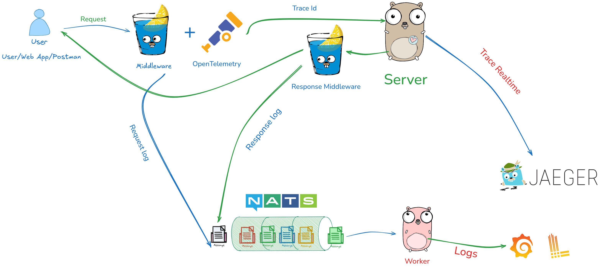

# 📊 Project: LogTrace System with OpenTelemetry & RabbitMQ

## *** System Design Document ***


## **1. Objectives**
- Log request & response with **Trace ID**.
- Push logs to **RabbitMQ** for asynchronous processing.
- Store logs in **Loki** for querying and visualization in **Grafana**.
- Track **tracing** with **OpenTelemetry & Jaeger**.
- Easily extendable for multiple microservices.

---

## **2. System Architecture**
### **Main Components:**
- **Middleware (Gin)**: Logs request & response, sends logs to RabbitMQ, integrates OpenTelemetry.
- **RabbitMQ (Message Queue)**: Supports asynchronous log processing.
- **Consumer (Worker)**: Receives logs from RabbitMQ, sends logs to Loki.
- **Loki + Grafana**: Stores & visualizes logs.
- **Jaeger (Tracing)**: Tracks request flow across multiple services.

---

## **3. Detailed Requirements**
### **🟢 Middleware (Gin)**
✅ Log **request & response**, including:
- **Trace ID** (from OpenTelemetry).
- **Method**, **URL**, **Status Code**.
- **Processing time** (Duration).
- **Request & response body**.
- **Headers**.

✅ Send logs to **RabbitMQ** queue `logs`.
✅ Include **Trace ID** in logs to link with Jaeger.

### **🟢 RabbitMQ**
✅ Queue `logs` receives logs from middleware.
✅ Ensures logs are not lost under high traffic conditions.

### **🟢 Consumer (Log Processor)**
✅ Receives logs from RabbitMQ.
✅ Prints logs to console for debugging.
✅ Sends logs to **Loki** via API.

### **🟢 Loki + Grafana**
✅ Stores logs in JSON format.
✅ Queries logs using **LogQL**.
✅ Connects to Grafana for visualization.

### **🟢 Jaeger (Tracing)**
✅ Tracks **full request flow**.
✅ Displays API processing time.
✅ Integrates with Grafana for logs linked to **Trace ID**.

---

## **4. Technologies Used**
- **Golang** (Gin Framework) – Middleware for logging requests.
- **OpenTelemetry** – Captures **Trace ID**.
- **RabbitMQ** – Message queue for asynchronous log processing.
- **Loki** – Log storage.
- **Grafana** – Log visualization.
- **Jaeger** – Request tracing analysis.
- **Docker Compose** – Orchestrates all services.

---

## **5. Workflow**
1. **Client sends request** to API.
2. **Middleware captures request**, retrieves **Trace ID**, logs request body.
3. **Log is pushed to RabbitMQ**.
4. **API processes request** and returns response.
5. **Middleware captures response**, logs response body & duration.
6. **Consumer retrieves log from RabbitMQ**, sends it to Loki.
7. **Loki stores logs**, Grafana visualizes logs.
8. **Jaeger tracks tracing**, displays detailed request flow.

---

## **6. Expected Outputs**
### **✅ Console Logs (Consumer)**:
```json
{
  "trace_id": "a1b2c3d4",
  "method": "POST",
  "path": "/login",
  "status": 200,
  "duration_ms": 12,
  "request_body": "{\"username\":\"admin\", \"password\":\"123\"}",
  "response_body": "{\"token\":\"abc.def.ghi\"}"
}
```

### **✅ Grafana Logs Query**:
```logql
{job="rabbitmq-logs"} | json | trace_id="a1b2c3d4"
```

### **✅ Jaeger UI**:
- Tracks **request flow** across multiple services.
- Displays API processing time.

---

## **7. Future Enhancements**
🚀 Support **gRPC** by logging gRPC request/response.
🚀 Extend for **multi-service** with OpenTelemetry Collector.
🚀 Integrate **ElasticSearch** for faster log search.

---

💡 **Outcome**: A powerful logging system with comprehensive tracing, making debugging easier and more efficient. 🚀


